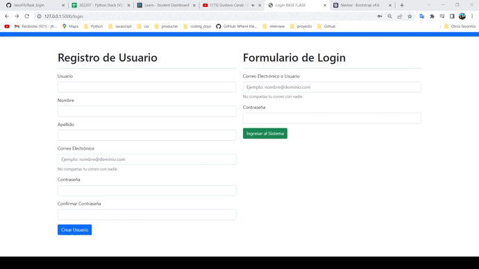

#   Flask_Mysql: Inicio de sesión y registro

## Contenido

    Aplicacion que requiere el inicio sesion y registro de un usuario, y además 
    que procese el cierre de sesion. 

  

## **Instalacion y configuracion**

#### Instalar un entorno virtual con  pipenv en forma global (omitir si ya está instalado):      
#### Window:
    pip install pipenv

#### Mac:
    pip3 install pipenv

#### Clona el repositorio del proyecto: 

    $ git clone https://github.com/JairoFR/flask_login.git
    $ cd flask_login

####  Instala desde Pipfile los paquetes que vienen configurados: 
    $ pipenv install

####  Activa el shell de Pipenv:
    $ pipenv shell

####  Detiene  el ambiente virtual en la terminal:
    $ exit

####  Cargar el script de la base de datos a MySql:  

    Ruta :  flask_app\docs\scripts.sql

### Abrir proyecto en un editor de codigo fuente

    1.- Abrir proyecto en visual studio code.
    2.- Ir a Python: select interpreter ctrl+shift+p.
    3.- Seleccionar el ambiente virtual creado con el nombre de la carpeta.
    4.- Renombrar archivo .env_ejemplo a .env y agregar datos faltantes.
    4.- Abrir nueva terminal y escribir python server.py

